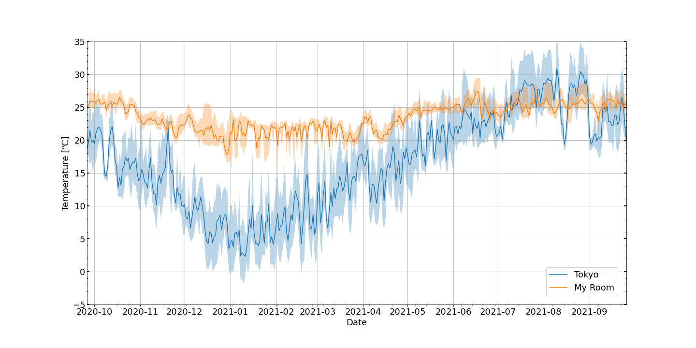

# RoomTemperature
 1年分の自宅の室温と気温の比較

 
## 特徴
- Switchbotを用いた室温データの利用
    - IoTシステムの[switchbot](https://www.switchbot.jp/)では、気温・室温を測定する製品がある。
    - これを一年ほど利用し、気温データが出力できたので、どうせならと東京都の気温データと比較した。

## Author
- Yuki Mori, 2021
    - ちなみに測定後引っ越したのでこの後データが追加されることはない。

## License
- このファイルはMITライセンスで公開している。
- This program and source code are distributed under the [MIT license](https://opensource.org/licenses/MIT).

- 東京都の気温[気象庁データ](https://www.jma.go.jp/jma/index.html)を利用している。